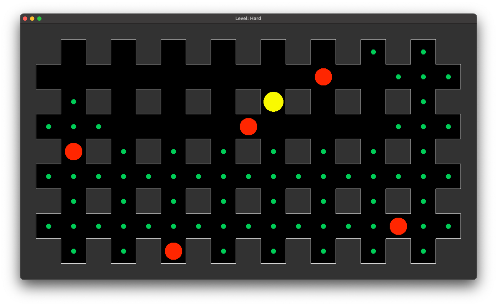
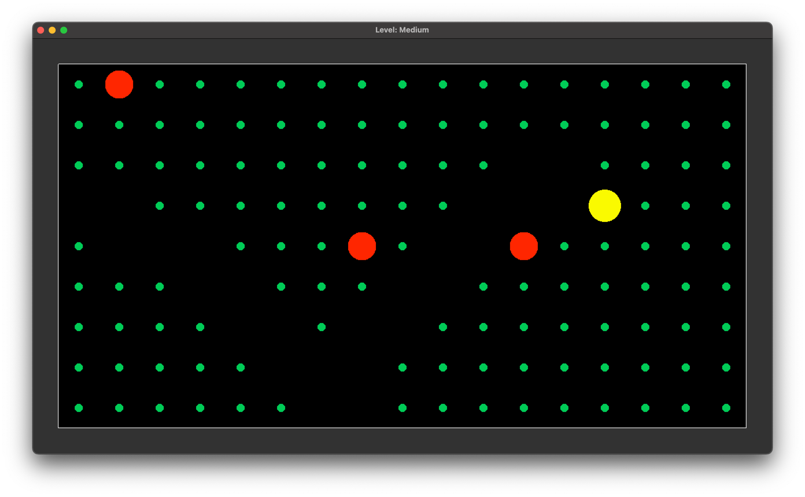
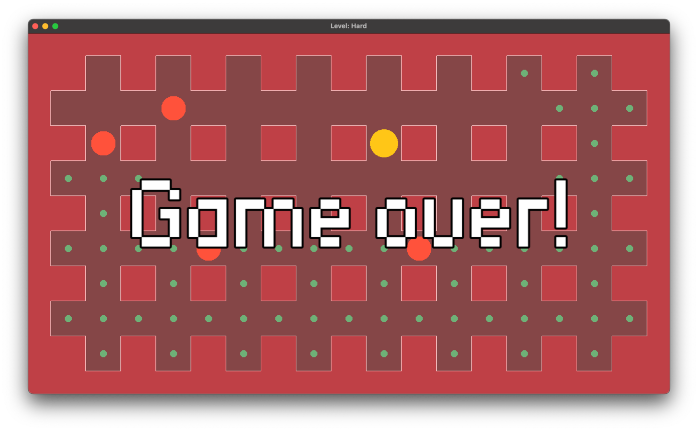
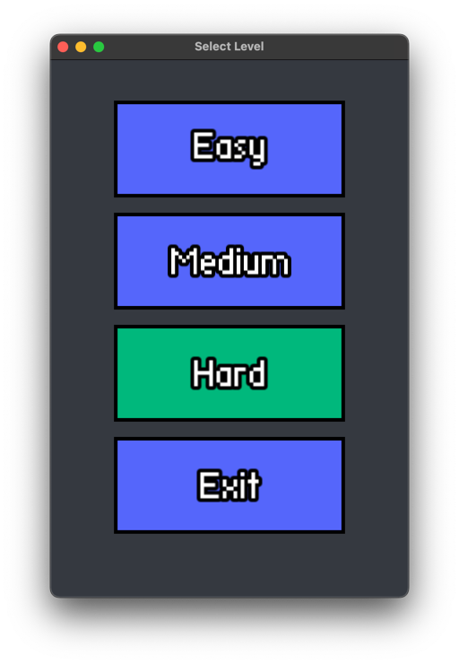

      

## Содержание

- [Технологии](#технологии)
- [Начало работы](#начало-работы)
- [Тестирование](#тестирование)
- [Deploy и CI/CD](#deploy-и-ci/cd)
- [Contributing](#contributing)
- [To do](#to-do)
- [Команда проекта](#команда-проекта)

## About this project

- Для отработки паттернов, таких как <перечисление>
- Для отработки ООП
- Для отработки SFML

Делал для отработки паттернов...

## How it looks

[//]: # (![Photo]&#40;doc/gameplay_hard.png&#41;)

[//]: # (![Photo]&#40;doc/gameplay_medium.png&#41;)

[//]: # (![Photo]&#40;doc/game_over.png&#41;)

[//]: # (
)

[//]: # (
)

## Documentation

### Технологии

- C++
- [SFML](https://www.sfml-dev.org/index.php)
- Patterns
    - State
    - Composite
    - Command
    - Prototype
    - Memento
    - Visitor
    - Builder
- CMake

### How to run

Как собрать проект

### How to use

You win if you eat all the available food. You lose if you run into a hostile mob.

- <kbd>w, a, s, d</kbd> Move PacMan
- <kbd>CTRL+Z</kbd> or <kbd>ESC</kbd> Cancel last movement

## Distribute

- [Макс Кудряшов](tg://resolve?domain=bzvyagintsev)
