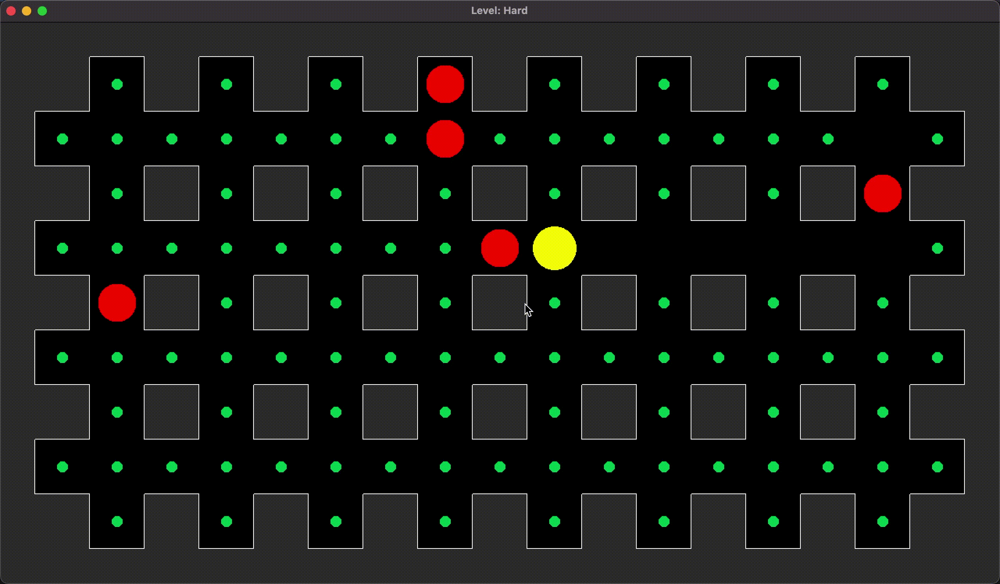
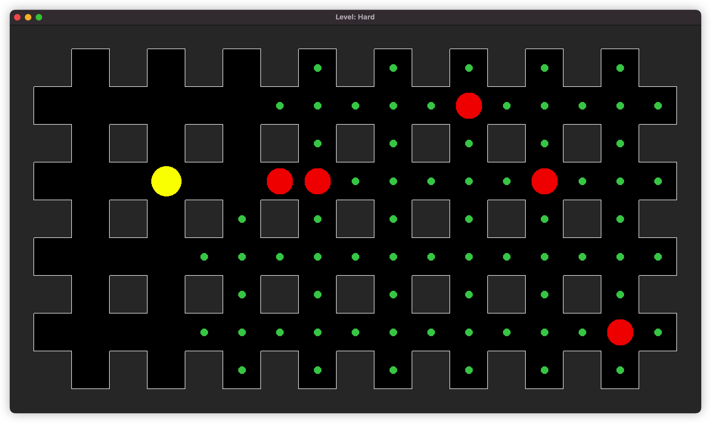

[//]: # (
)

[//]: # (      )

[//]: # (
)

## О проекте

Игра на основе существующей игры PacMan, созданная на языке `C++` с визуализацией через `SFML`, с целью практики в ООП,
паттернах (таких как
state, compose, prototype и др.) и `SFML`.

## Технологии

- `C++`
- `SFML`
- Паттерны:
    - State
    - Command
    - Composite
    - Prototype
    - Memento
    - Visitor
    - Builder

## Скриншоты

## Управление

Чтобы победить, нужно съесть всю еду. Если вы столкнетесь с врагом, то вы проиграете.

- <kbd>W, A, S, D</kbd> чтобы двигаться.
- <kbd>CTRL+Z</kbd> or <kbd>ESC</kbd> чтобы отменить последнее перемещение.

## Контакты

[Telegram](t.me/kudrmax) - [GitHub](https://github.com/kudrmax)
